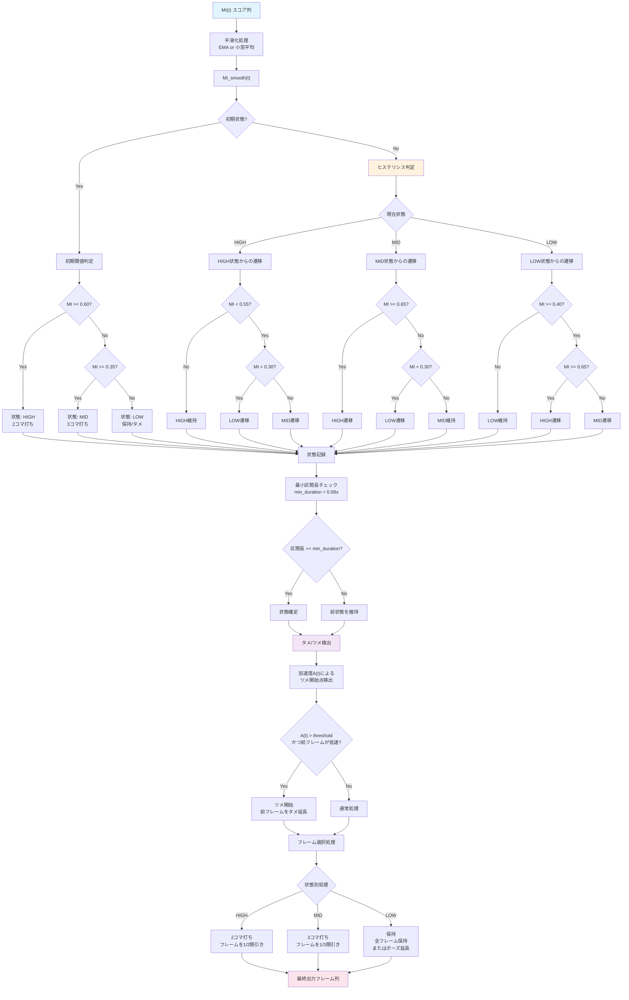
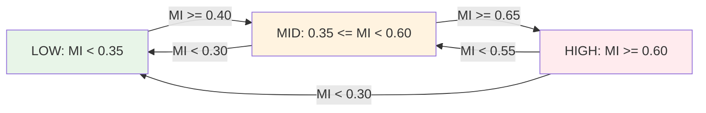

# コマ打ち判定アルゴリズム

## ヒステリシス閾値設定

## パラメータ設定

| パラメータ | デフォルト値 | 説明 |
|----------|-------------|------|
| 上位閾値 | 0.60 | HIGH状態への遷移閾値 |
| 下位閾値 | 0.35 | LOW状態への遷移閾値 |
| ヒステリシス幅 | ±0.05 | 状態遷移の余裕 |
| 最小区間長 | 0.08秒 | 状態維持最小時間 |
| 平滑化窓 | 3フレーム | MI値の平滑化窓サイズ |
