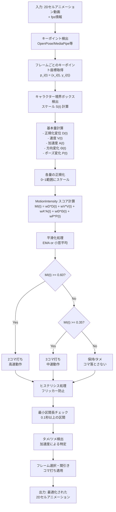
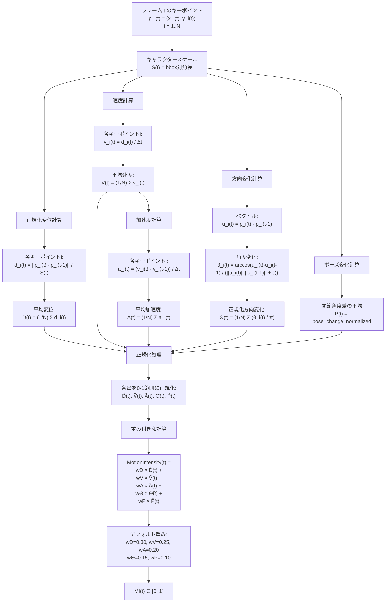
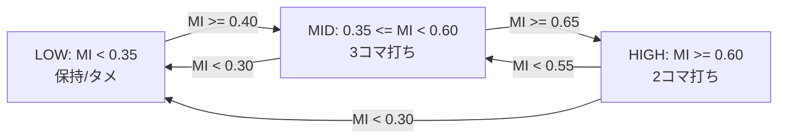

<script type="module">
import mermaid from 'https://cdn.jsdelivr.net/npm/mermaid@latest/dist/mermaid.esm.min.mjs';
mermaid.initialize({ 
  startOnLoad: true
});
  await mermaid.run({
  querySelector: '.language-mermaid',
});
</script>

# 2Dアニメ自動コマ打ちシステム
## 実装計画とアーキテクチャ

**タメ/ツメを意識した自動フレーム制御システム**

---

## プロジェクト概要

### 目標
- 2Dセルアニメーションの動きの激しさを定量化
- タメ/ツメを考慮した自動コマ打ち（2コマ/3コマ打ち）
- アニメーター向けの実用的なツール開発

### アプローチ
- キーポイント検出による動作解析
- MotionIntensityスコアによる動きの定量化
- ヒステリシス判定による安定した分類

---

## システム全体アーキテクチャ



---

## MotionIntensityスコア計算

### 基本量の定義

| 要素 | 計算式 | 重み | 意味 |
|------|--------|------|------|
| 正規化変位 | `D(t) = (1/N) Σ ||p_i(t) - p_i(t-1)|| / S(t)` | 0.30 | 移動距離 |
| 速度 | `V(t) = D(t) / Δt` | 0.25 | 移動速度 |
| 加速度 | `A(t) = (V(t) - V(t-1)) / Δt` | 0.20 | 速度変化 |
| 方向変化 | `Θ(t) = (1/N) Σ θ_i(t) / π` | 0.15 | 方向転換 |
| ポーズ変化 | `P(t) = pose_change_normalized` | 0.10 | 体勢変化 |

### 最終スコア
```
MI(t) = 0.30×D̃(t) + 0.25×Ṽ(t) + 0.20×Ã(t) + 0.15×Θ̃(t) + 0.10×P̃(t)
```

---

## MotionIntensity計算フロー詳細



---

## コマ打ち判定アルゴリズム

### ヒステリシス状態遷移



### パラメータ設定
- **上位閾値**: 0.60 (HIGH状態への遷移)
- **下位閾値**: 0.35 (LOW状態への遷移) 
- **ヒステリシス幅**: ±0.05
- **最小区間長**: 0.08秒 (フリッカー防止)

---

## タメ/ツメ検出アルゴリズム

### ツメ開始点の検出
1. **加速度監視**: `A(t) > threshold` かつ前フレームが低速
2. **タメ延長**: ツメ開始直前の数フレームを保持
3. **演出強化**: 動きの境界を明確化

### 実装ポイント
- 加速度の立ち上がりを監視
- 速度が低い状態からの急激な変化を検出
- 前後のコンテキストを考慮した判定

---

## 実装ステップ

### Phase 1: 基盤構築
1. **キーポイント検出システム**
   - OpenPose/MediaPipe統合
   - 2Dアニメ特化のカスタマイズ

2. **基本量計算エンジン**
   - 変位・速度・加速度計算
   - スケール正規化処理

### Phase 2: スコアリング
3. **MotionIntensityスコア**
   - 重み付き和の実装
   - パラメータ調整インターフェース

4. **平滑化・正規化**
   - 時系列データ処理
   - ノイズ除去機能

---

## 実装ステップ（続き）

### Phase 3: 判定システム
5. **ヒステリシス判定器**
   - 状態遷移ロジック
   - フリッカー防止機能

6. **タメ/ツメ検出**
   - 加速度ベース検出
   - 演出補強機能

### Phase 4: 出力・UI
7. **フレーム処理エンジン**
   - コマ打ち適用
   - 中割り補完（オプション）

8. **ユーザーインターフェース**
   - リアルタイムプレビュー
   - パラメータ調整UI
   - バッチ処理機能

---

## 技術スタック

### コア処理
- **Python**: メイン言語
- **OpenCV**: 画像処理
- **NumPy/SciPy**: 数値計算
- **MediaPipe/OpenPose**: キーポイント検出

### UI・可視化
- **Streamlit/Flask**: Webインターフェース
- **Matplotlib/Plotly**: グラフ表示
- **FFmpeg**: 動画処理

### オプション拡張
- **PyTorch**: 学習ベース改善
- **ONNX**: モデル軽量化

---

## 評価・検証計画

### 定量評価
- **A/Bテスト**: 人間の評価者による比較
- **一貫性評価**: 同一素材での再現性確認
- **性能評価**: 処理速度とメモリ使用量

### 定性評価
- **アニメーター評価**: 実制作現場での検証
- **ユーザビリティテスト**: UI/UX評価
- **演出意図保持**: 原作品との比較

### 継続改善
- **パラメータ最適化**: 大量データでのチューニング
- **学習ベース改善**: 判定精度向上
- **新機能追加**: 残像生成等の演出補強

---

## 期待される効果

### 制作効率化
- **作業時間短縮**: 手作業コマ打ち時間の削減
- **一貫性向上**: 客観的指標による品質統一
- **リソース最適化**: 人的リソースの効率配分

### 表現品質向上
- **タメ/ツメ最適化**: 動きの演出効果向上
- **動作の自然性**: 数値的根拠に基づく判定
- **視覚的インパクト**: 適切なコマ制御による表現力強化

### 技術波及効果
- **アニメ業界DX**: デジタル技術活用促進
- **ナレッジ蓄積**: 動作解析技術の体系化
- **後続技術**: 自動中割り等への応用可能性

---

## 次のステップ

### 即座に着手可能
1. **プロトタイプ開発**: 基本機能の実装
2. **テストデータ準備**: 評価用アニメクリップ収集
3. **初期パラメータ調整**: デフォルト値の最適化

### 中期的取り組み
4. **実制作現場での試験運用**
5. **大規模データでの検証**
6. **UI/UX改善とユーザビリティ向上**

### 長期的展望
7. **学習ベースモデルの統合**
8. **リアルタイム処理への最適化**
9. **業界標準ツール化への展開**

---

## まとめ

- **技術的実現可能性**: 既存技術の組み合わせで実装可能
- **実用性**: アニメーション制作現場のニーズに対応
- **拡張性**: 将来的な機能追加・改善に対応可能
- **汎用性**: 2Dアニメーション全般に適用可能

**次回**: プロトタイプ実装と初期評価の実施

---

# ありがとうございました

**質問・議論をお待ちしています**

---