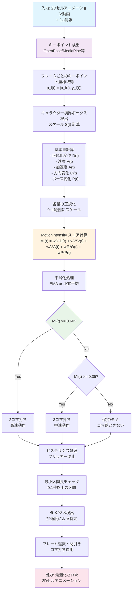

# 2Dアニメ自動コマ打ちシステム - 全体フロー図

```mermaid
flowchart TD;
    A["入力: 2Dセルアニメーション動画<br/>+ fps情報"] --> B["キーポイント検出<br/>OpenPose/MediaPipe等"]
    
    B --> C["フレームごとのキーポイント座標取得<br/>p_i(t) = (x_i(t), y_i(t))"]
    
    C --> D["キャラクター境界ボックス検出<br/>スケール S(t) 計算"]
    
    D --> E["基本量計算<br/>- 正規化変位 D(t)<br/>- 速度 V(t)<br/>- 加速度 A(t)<br/>- 方向変化 Θ(t)<br/>- ポーズ変化 P(t)"]
    
    E --> F["各量の正規化<br/>0~1範囲にスケール"]
    
    F --> G["MotionIntensity スコア計算<br/>MI(t) = wD*D(t) + wV*V(t) + wA*A(t) + wΘ*Θ(t) + wP*P(t)"]
    
    G --> H[""平滑化処理<br/>EMA or 小窓平均""]
    
    H --> I{"MI(t) >= 0.60?"}
    I -->|Yes| J["2コマ打ち<br/>高速動作"]
    I -->|No| K{"MI(t) >= 0.35?"}
    
    K -->|Yes| L["3コマ打ち<br/>中速動作"]
    K -->|No| M["保持/タメ<br/>コマ落とさない"]
    
    J --> N["ヒステリシス処理<br/>フリッカー防止"]
    L --> N
    M --> N
    
    N --> O["最小区間長チェック<br/>0.1秒以上の区間"]
    
    O --> P["タメ/ツメ検出<br/>加速度による特定"]
    
    P --> Q["フレーム選択・間引き<br/>コマ打ち適用"]
    
    Q --> R["出力: 最適化された<br/>2Dセルアニメーション"]
    
    style A fill:#e1f5fe
    style B fill:#f3e5f5
    style G fill:#fff3e0
    style I fill:#e8f5e8
    style R fill:#fce4ec
```

## 主要処理ステップ

1. **前処理**: キーポイント検出とスケール正規化
2. **特徴量抽出**: 動きの各側面を数値化
3. **スコア計算**: 重み付き和でMotionIntensityを算出
4. **判定処理**: 閾値とヒステリシスによる分類
5. **後処理**: タメ/ツメの最適化とフレーム出力
